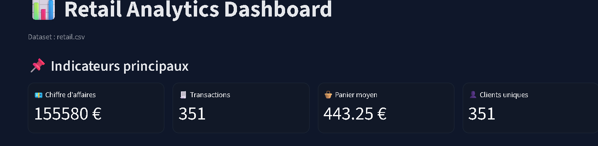
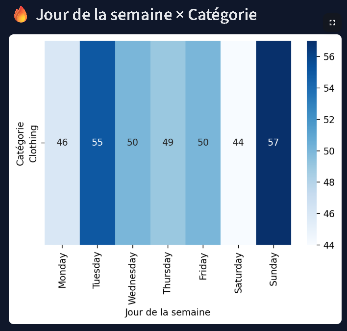
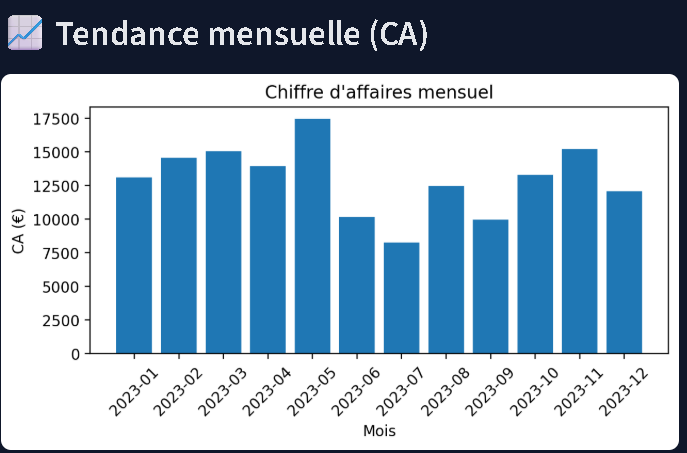
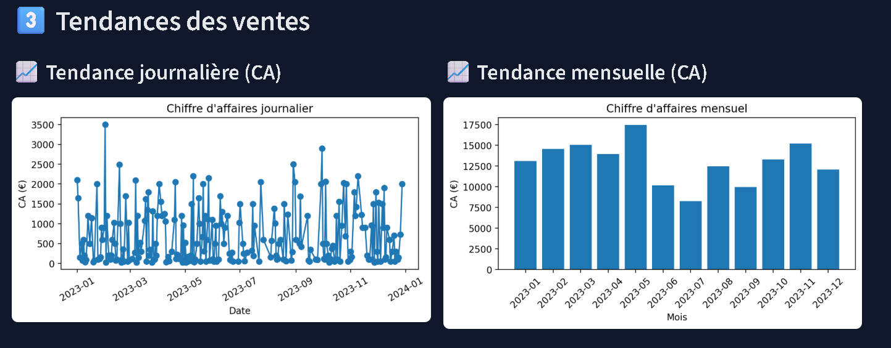
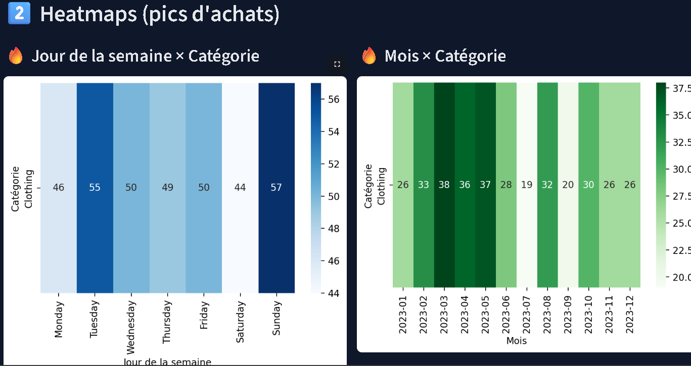
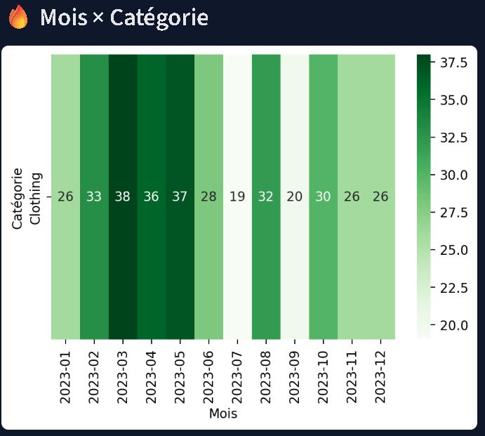
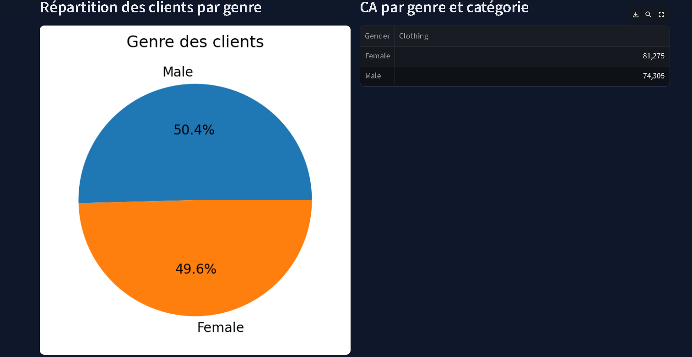

> 🎓 Ce projet est mon tout premier projet Data Analyst.
> J’ai appris à construire un dashboard professionnel étape par étape,  
> accompagné par *ChatGPT comme assistant pédagogique* pour accélérer mon apprentissage  
> et comprendre les bonnes pratiques en analyse de données.
> Merci pour votre lecture.  
Je suis ouvert à tout retour ou conseil pour améliorer ce projet ou progresser dans mon parcours Data Analyst.

# 🛍️ Retail Analytics Dashboard

Un tableau de bord interactif conçu pour analyser les ventes d’une boutique à partir d’un dataset retail.  
Ce projet combine **Python, Pandas, Streamlit, Matplotlib et Seaborn** pour offrir une vue claire, dynamique et professionnelle des performances commerciales.

---

# 📊 1. Objectifs du Projet

- Identifier les catégories de produits les plus rentables  
- Analyser les comportements d'achat selon les jours et les mois  
- Étudier les tendances du chiffre d’affaires  
- Explorer le profil des clients (genre, habitudes d’achat)  
- Construire un dashboard professionnel et clair
---

# 📂 2. Structure du Projet

📁 retail-analytics-dashboard
│── dashboard.py
│── requirements.txt
│── retail_sample.csv ou retail.csv
│── Screenshots/
│ ├── Dailytrend.png
│ ├── Dailyweek.png
│ ├── Gendercustomer.png
│ ├── Global.png
│ ├── Globaltrend.png
│ ├── Heatmaps.png
│ ├── Monthlytrend.png
│ ├── MonthxCategory.png
│── README.md

---

# 🧮 3. Fonctionnalités du Dashboard

## ✅ KPI principaux
- 💶 Chiffre d’affaires total  
- 🧾 Nombre de transactions  
- 🧺 Panier moyen  
- 👤 Nombre de clients uniques  

📸 *Aperçu :*

---

## 📈 4. Analyses temporelles

### 🔹 Tendance journalière du CA

### 🔹 Tendance hebdomadaire (jours de la semaine)

### 🔹 Tendance mensuelle

### 🔹 Tendance globale

---

# 🔥 5. Heatmaps — Pics d’achats

### 🔹 Jour × Catégorie
### 🔹 Mois × Catégorie

Ces graphiques permettent d’identifier les périodes les plus actives.

📸 *Aperçu :*  

---

# 🧑‍🤝‍🧑 6. Analyse par Genre

Analyse de la répartition client + performance par genre.

📸 Exemple :  

---

# 🧠 7. Compétences Démontrées

- Nettoyage & préparation de données  
- Manipulation avancée avec Pandas  
- Création de visualisations : barplots, heatmaps, pie charts, courbes de tendance  
- Développement d’un dashboard interactif avec Streamlit  
- Structuration d’un projet Data professionnel  
- Versionnement avec Git & GitHub  

---

# 🛠️ 8. Technologies Utilisées

- Python 3  
- Pandas  
- NumPy  
- Matplotlib  
- Seaborn  
- Streamlit  

---

